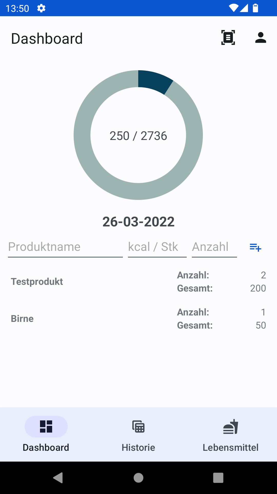
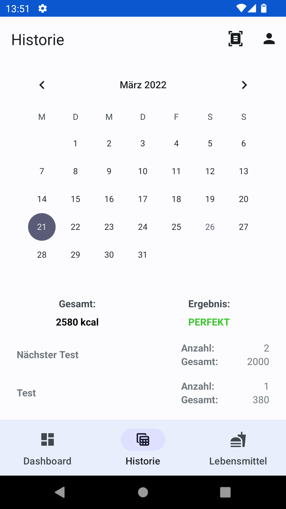
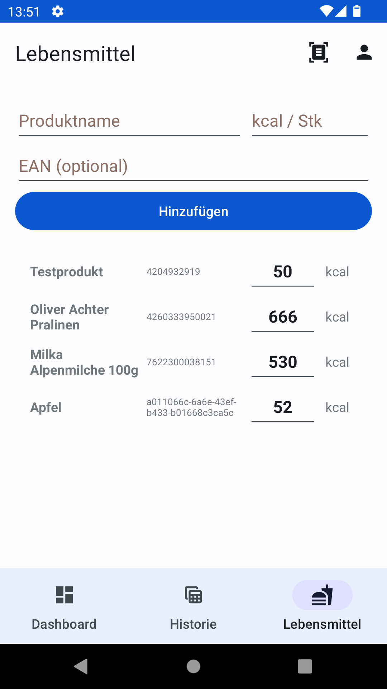
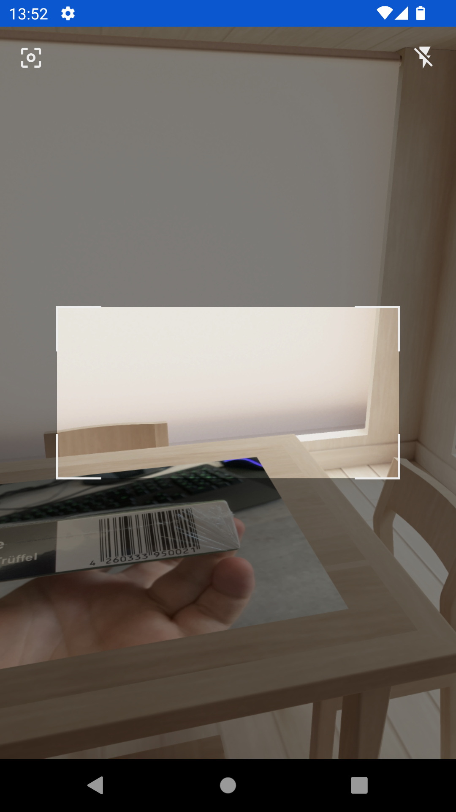
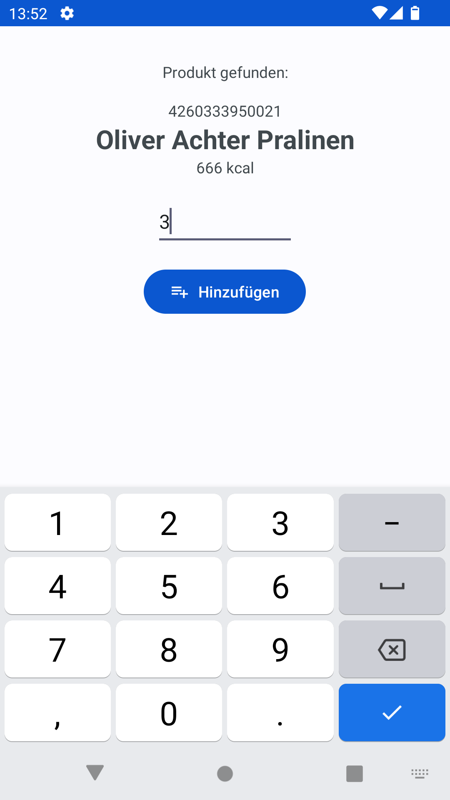
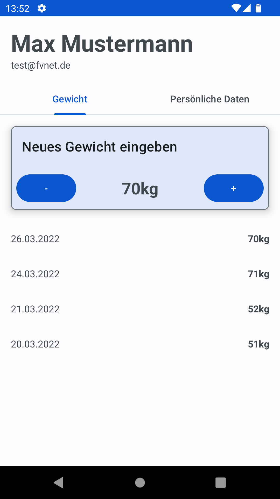
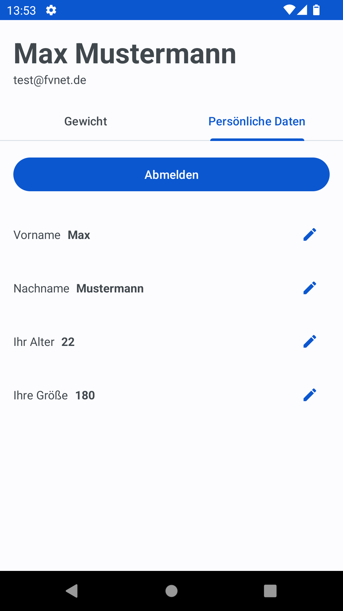

# Calorie Tracker

## Projektbeschreibung

### Projektziele

#### Hintergrund

Wir wollen eine App entwickeln, die es den Nutzerinnen und Nutzern ermöglicht, ihre tägliche Kalorienaufnahme im Blick zu behalten. Dabei soll die App intuitiv bedienbar sein und an die Eingabe der Daten aktiv erinnern, um Vollständigkeit zu gewährleisten und den Gebrauch der App zu unterstützen. Diese App ist relevant sowohl für sportliche Nutzerinnen und Nutzer, die den Überblick über ihre Ernährung behalten wollen, als auch für Menschen, die damit ab- oder zunehmen wollen. Für die Zielgruppe ist es wichtig, dass die Eingabe der zu sich genommenen Kalorien unterwegs und möglichst schnell erfolgen kann. Eine Android-App eignet sich dafür also hervorragend.

#### Ziele

Nutzerinnen und Nutzer können:

* sich geräteunabhängig mit einem Account anmelden
* konsumierte Lebensmittel & Produkte zum aktuellen Tag hinzufügen
* Lebensmittel aus einer Datenbank zum aktuellen Tag hinzufügen
* neue Lebensmittel in der Datenbank anlegen, die Nutzerunabhängig abgerufen werden können
* Barcodes von Produkten einscannen
* den eigenen historischen Konsumverlauf nach Tagen gruppiert betrachten
* ihr Gewicht erfassen und den Gewichtsverlauf beobachten
* Errinerungs-Benachrichtigungen auf ihr Gerät gesendet bekommen
* ein Widget auf dem Startbildschirm plaztieren

#### WICHTIGE HINWEISE

Anforderungen: min. API 29, target API 31

Zugangsdaten für den Account mit Beispieldaten:  
E-Mail: test@fvnet.de  
Passwort: xam321  

#### Funktionen
|Screenshot|Funktion|
|---|---|
||Das Dashboard zeigt alle wichtigen Informationen zum aktuellen Tag an. In der AppBar befindet sich der Schnellzugriff auf Barcode-Scanner und die Einstellungen. Die runde ProgressBar füllt sich, je mehr Kalorien konsumiert wurden. Wenn mehr als die maximal empfohlene Menge konsumiert wird, färbt sich der Balken rot, wenn es im ordentlichen Bereich ist grün. In die EditTexts darunter können die hinzuzufügenden Daten eingegeben werden. Darunter finden sich die bereits eingegebenen konsumierten Lebensmittel mit Anzahl und Gesamtkalorien. Ganz unten findet sich die Tab Bar, wo der Nutzer zu anderen Funktionen wechseln kann.|
||Die Historie zeigt die Kaloriendaten vergangener Tage an. Im Kalender lässt sich der gewünschte Tag auswählen, darunter zeigt die App dann die konsumierten Kalorien links und die Einordnung der Menge rechts an. Die Darstellung ist dabei nutzerfreundlich in "zu viel", "zu wenig" und "perfekt" eingeteilt und erfolgt farbkodiert. Darunter werden alle an dem Tag konsumierten Lebensmittel mit Gesamtkalorien und Menge angezeigt.|
||Die Lebensmitteldatenbank enthält alle Lebensmittel mit bekannter Kalorienangabe. Der oder die Nutzerin kann hier neue Daten hinzufügen, die für alle Nutzerinnen und nutzer sichtbar sind. In die EditTexts lassen sich Name, Kalorien pro VPE und eine optionale EAN-Nummer eingeben, die erforderlich ist, um das Produkt mit dem Barcodescanner scanbar zu machen. Mit einem Druck auf "Bestätigen" wird das Lebensmittel in die Liste darunter hinzugefügt. Dort stehen alle Lebensmittel, die sich in der Datenbank befinden. Die Liste kann mit einer Eingabe von Suchbegriffen in den EditText für den Produktnamen durchsucht werden. Mit dem EditText bei den einzelnen Items lassen sich die Kalorienwerte für die einzelnen Produkte verändern. Eine Bestätigung ist dabei nicht nötig.|
||Mithilfe des Barcode-Scanners lassen sich ganz einfach Barcodes von Produkten einscannen. Anhängig davon, ob das Produkt bereits bekannt ist oder nicht, wird entweder direkt das gefundene Produkt angezeigt (siehe nächster Screenshot) oder eine Eingabemaske, um ein neues Produkt/Lebensmittel anzulegen.|
||Hier wird das gefundene Produkt mit den Lebensmitteldaten dargestellt. Über dem Produktnamen steht der EAN-Code, darunter die Kalorienangabe aus der Datenbank. In das Nummernfeld lässt sich die Anzahl der zu sich genommenen Produkte eingeben.|
||Mit den Einstellungen öffnet sich zunächst die Gewichts-Historie. Ganz oben stehen die aktuellen Account-Informationen, also Name und E-Mail-Adresse. In dem Gewichtsfenster lässt sich oben das derzeitige Gewicht ändern. Fals an diesem Tag noch kein Gewicht erfasst wurde, wird ein neuer Datenpunkt in der Historie erstellt. Andernfalls wird der heutige Datenpunkt aktualisiert. In der Liste unter der Card sind die vergangenen Messungen aufgelistet.|
||Im zweiten Tab der Einstellungen lassen sich die persönlichen Daten ändern. Mit einem Tap auf den Stift-Button lassen sich Name, Alter und Größe ändern. Diese Daten sind für die Kalorienberechnung relevant. Darüber befindet sich der Logout-Button, mit dem man sich in der App abmelden kann.|
|Widget|Das Widget zeigt den tagesaktuellen Kalorienkonsum an. Rechts von den Test-Angaben wird das auch nochmal visuell in einer runden Progress-Bar dargestellt, die wie auch im Dashboard farbkodiert ist. |
|Notifications|Ein mal am Tag sendet die App eine Benachrichtigung an die Nutzerin oder den Nutzer, um an die Eingabe der konsumierten Kalorien zu erinnern. Das wurde mittels AndroidX Worker umgesetzt.|

### Funktionen

|Funktion|Beschreibung|Aufwand|Dateien|Hinweise|
|---|---|---|---|---|
|Responsive Layout|Das App-Layout ist für eine bessere UX auf verschiedenen Gerätetypen responsiv.|1|finden Sie in den entsprechenden Ordnern res/layout-[window size]|Nur dort erfüllt, wo es auch Sinn macht, da viele Layouts keine Anpassung benötigen|
|Tabbing|Die Navigation auf Layer 0 funktioniert über Tabbing. |1|res/navigation/mobile-navigation.xml, res/menu/bottom_nav_menu.xml, MainActivity| |
|Fragments|Die wiederverwendbaren Layoutbausteine sind als Fragments implementiert|1|Beispiel: SettingsKeyValueFragment, das dynamisch in SettingsPersonalFragment plaziert wird (u.v.w)|Nicht in Pitch aufgeführt, aber implementiert|
|Einfacher Adapter|Objekte, die über einen RecyclerView dargestellt werden sollen, besitzen eine selbst implementierte Adapterklasse.|1|FSItemAdapter, FSProductAdapter|Nicht in Pitch aufgeführt, aber implementiert|
|Intents ohne Payload|Die App nutzt Intents ohne Payload, um neue Activities zu starten (z.B. die Einstellungs-Activity)|1|MainActivity|Nicht in Pitch aufgeführt, aber implementiert|
|Intents mit Payload|Die App nutzt Intents mit Payload, z.B. um den mit dem Barcode-Scanner erfassten EAN-Code an die Result Activity weiterzugeben.|1|BarcodeScannerActivity, BarcodeResultActivity|Nicht in Pitch aufgeführt, aber implementiert|
|Widget (einfach)|Die tagesaktuellen Kaloriendaten können über ein Widget auch auf dem Homescreen platziert werden. Dabei wird der aktuelle Anteil am Tagesbedarf auf einer runden ProgressBar anschaulich und farbkodiert dargestellt.|2|res/navigation/mobile-navigation.xml, res/menu/bottom_nav_menu.xml, MainActivity| |
|Notifications|Die Nutzerinnen und Nutzer werden ein mal am Tag daran erinnert, ihre konsumierten Kalorien einzugeben und hinzuzufügen. Bei einem Tap auf die Notification wird die App direkt geöffnet.|2|NotificationWorker| |
|App Shortcuts|Die Nutzerinnen und Nutzer können über einen App-Shortcut direkt auf die Barcode-Scanner-Fuktion der App zugreifen.|2|res/xml/shortcuts.xml| |
|Barcodes lesen und auswerten|Mittels Barcode-Scanner kann ein EAN-Code eines Produkts gescannt und die Nährwertangaben aus der Produktdatenbank abgerufen werden.|3|res/layout/activity_barcode_scanner.xml, BarcodeScannerActivity| |
|Firebase-Integration|Die Authentifizierung von Nutzerinnen und Nutzern funktioniert über Google Firebase. Die Produktdatenbank und die persönlichen Daten werden in einer Cloud Firestore Datenbank gespeichert.|3|FirestoreHandler, diverse Klassen zur Authentifizierung (z.B. LoginActivity oder RegisterActivity)| |
|∑|   |18|   |   |

Hinweis: "Daten verschlüsselt speichern" und "Daten verschlüsselt versenden" wurden aus der Feature Liste gestrichen, da eine Implementierung im finalen Kontext keinen Sinn ergibt. Die Firebase Library kümmert sich um die gesamte Datenpersistenz und die Datenübertragung.

### Demo

## Team

### Vorstellung

* Nick Kelldorfner, nick.kelldorfner@fvnet.de, byNick33
* Kieu Minh Tri, trikieu293@gmail.com, trikieu293
* Pham Bao Long, chokyorikun@gmail.com, chokyori

### Zuständigkeiten

* Login-UI & Funktion: Nick Kelldorfner
* Preferences & Profile UI mit Eingabe der persönlichen Daten und des Gewichts: Nick Kelldorfner
* Firebase-Authentifizierung und Firestore-Anbindung: Nick Kelldorfner
* Barcode-Scanner: Nick Kelldorfner
* Widget: Nick Kelldorfner
* Notifications: Nick Kelldorfner
* Home-UI: Pham Bao Long & Kieu Minh Tri
* Home-Function und Local-Datenbank : Kieu Minh Tri & Pham Bao Long
* History-UI und Funktion: Kieu Minh Tri
* Lebensmitteldatenbank-UI und Funktion: Kieu Minh Tri

## Guidelines zur Nutzung dieses Repositorys

### Allgemeine Hinweise und Vorgaben

* Das Repository besteht im initialen Stand aus einem einzelnen Master-Branch. Versuchen Sie bei der Arbeit am Projekt darauf zu achten, dass sich in diesem Branch stets die aktuell lauffähige und fehlerfreie Version Ihrer Anwendung befindet. Nutzten Sie für die eigentliche Entwicklung ggf. weitere Branches.
* Gehen Sie sorgfältig bei der Erstellung von Issues und *Commit Messages* vor: Die Qualität dieser Artefakte fließt nicht in die Bewertung ein, trotzdem sollten Sie versuchen, Ihr Vorgehen anhand nachvollziehbarer Versionseinträge und klarere Aufgabenbeschreibung gut zu dokumentieren.
* Halten Sie diese Readme-Datei(en) stets aktuell.
* Diese sollte auch wichtige Informationen für die Nutzung beinhalten (Handbuch).
* Spätestens zur Projektabgabe legen Sie eine Release-Version des finalen Stands Ihrer Anwendung an und hängen an diese eine installierbare (Debug-) APK-Datei an.
* Achten Sie insbesondere darauf anzugeben, welches API-Level / NDK-Version ihrem Projekt zugrunde liegt und auf die 'Kompilierbarkeit' ihres finalen Codes.
